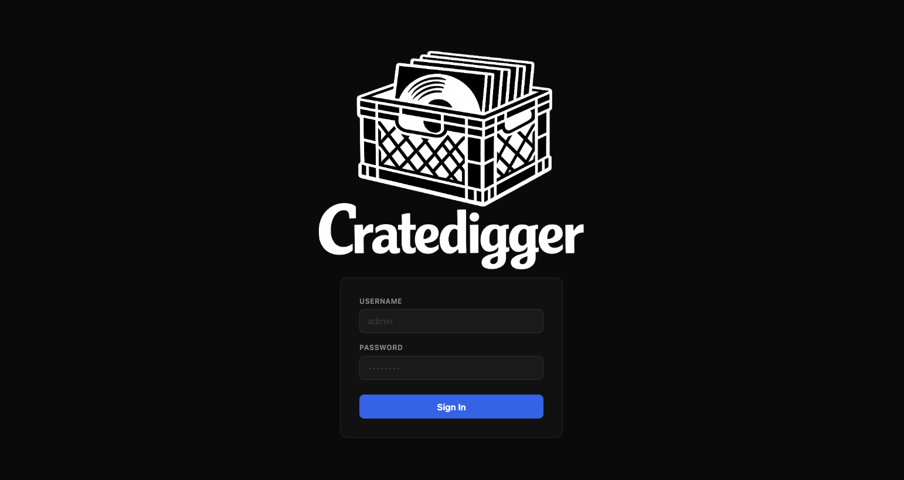
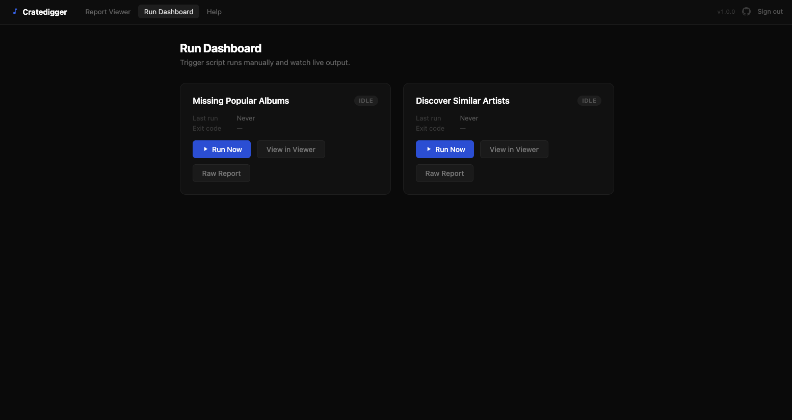
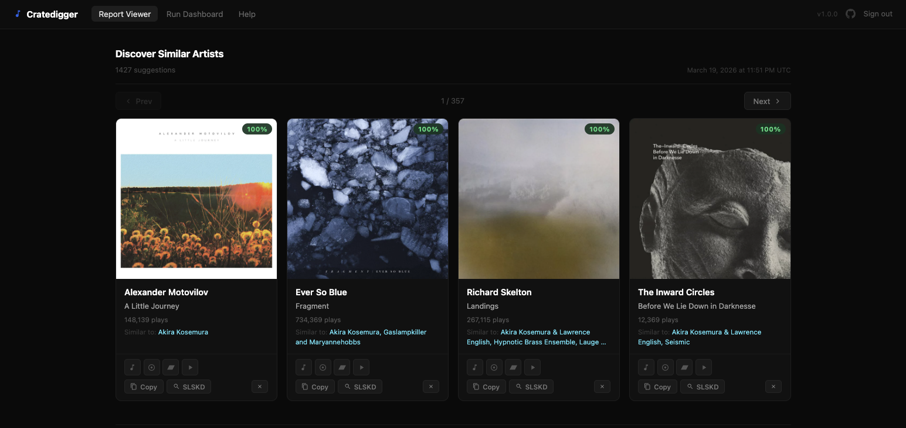

# Cratedigger

Two music discovery scripts that scan your collection and generate reports from Last.fm data. Run them from the command line or let a Docker-hosted web dashboard trigger and schedule them.

**Missing Popular Albums** — for every artist you own, finds the single highest-playcount album or EP you don't have yet.

**Discover Similar Artists** — queries Last.fm for artists similar to those in your collection, filters out anything you already own, and surfaces the top recommendation per candidate with their most popular album.

**New & Trending** — pulls new releases from up to 9 sources (Spotify, Last.fm, Bandcamp, AOTY, Juno, ListenBrainz), scores them against your Last.fm scrobble history and Navidrome library, and splits results into three sections: releases from artists you own or scrobble, releases from related artists, and everything else with a positive score.

<p align="center">
  
</p>

<p align="center">
  
</p>

<p align="center">
  
</p>

---

## Requirements

- Docker (recommended) **or** Python 3.12+
- A [Last.fm API key](https://www.last.fm/api/account/create) (free)
- A [Navidrome](https://www.navidrome.org/) instance **or** a local music directory

---

## Quick Start — Docker (recommended)

Docker gives you a web dashboard to trigger runs, watch live logs, view reports, and schedule automatic scans — no Python setup required.

```bash
git clone https://github.com/cdeschenes/cratedigger.git
cd cratedigger

cp .env.example .env
# Edit .env — at minimum set:
#   LASTFM_API_KEY   — your Last.fm API key
#   AUTH_PASS        — password for the web UI
#   SECRET_KEY       — any long random string
#   NAVIDROME_*      — or set MUSIC_ROOT to your local music path

docker compose pull
docker compose up -d
```

The image is pre-built and published to `ghcr.io/cdeschenes/cratedigger:latest`. There is no local build step.

Open **http://localhost:8080** and sign in with `admin` / your `AUTH_PASS`.

> **Music folder:** If you're not using Navidrome, uncomment the volume line in `docker-compose.yaml` and point it at your music directory.

---

## Quick Start — CLI only

Run the scripts directly without Docker. Reports are written as standalone HTML files.

```bash
python3 -m venv .venv
source .venv/bin/activate
pip install -r requirements.txt

cp .env.example .env
# Edit .env — set LASTFM_API_KEY and NAVIDROME_* (or MUSIC_ROOT)

python missing_popular_albums.py
python discover_similar_artists.py
```

Reports are written to `missing_popular_albums.html` and `discover_similar_artists.html` in the current directory (overridable via `.env`).

---

## Configuration

All settings live in `.env`. Copy `.env.example` to get started — required fields are clearly marked at the top. When using Docker, output paths are pinned to the `/data` volume automatically and should not be set manually.

### Library / API

| Variable | Default | Required | Purpose |
|---|---|---|---|
| `LASTFM_API_KEY` | | Yes | Last.fm API key. Get one at last.fm/api. Also used for Last.fm charts in New & Trending. |
| `MUSIC_ROOT` | `/Volumes/NAS/Media/Music/Music_Server` | Fallback | Filesystem path to scan when Navidrome is not configured. |
| `NAVIDROME_URL` | | No | Base URL of your Navidrome instance, e.g. `https://navidrome.example.com` |
| `NAVIDROME_USER` | | No | Navidrome username |
| `NAVIDROME_PASS` | | No | Navidrome password |
| `NAVIDROME_MUSIC_FOLDER` | | No | Navidrome library name to restrict the scan to. If set and the name doesn't match, the script aborts and lists available names. Leave empty to scan all libraries. |

All three of `NAVIDROME_URL`, `NAVIDROME_USER`, and `NAVIDROME_PASS` must be set to use Navidrome. If any are missing, the script falls back to the filesystem scan.

### Script tuning

| Variable | Default | Purpose |
|---|---|---|
| `FUZZ_THRESHOLD` | `90` | Fuzzy-match sensitivity (0–100). Lower = more permissive matching. Rarely needs changing. |
| `DEFAULT_WORKERS` | `4` | Concurrent Last.fm requests per run. |
| `MAX_WORKERS` | `8` | Upper bound enforced by `--workers`. |
| `TOP_ALBUM_LIMIT` | `25` | How many of an artist's top albums to fetch from Last.fm. |
| `REQUEST_TIMEOUT` | `15` | HTTP timeout in seconds. |
| `REQUEST_DELAY_MIN` | `0.15` | Minimum random delay between Last.fm requests (seconds). |
| `REQUEST_DELAY_MAX` | `0.3` | Maximum random delay between Last.fm requests (seconds). |
| `MAX_RETRIES` | `3` | Retry attempts on Last.fm API errors. |
| `CACHE_VERSION` | `2` | Internal. Increment to force a full cache refresh after structural changes. |

### Output paths

| Variable | Default | Purpose |
|---|---|---|
| `HTML_OUT` | `missing_popular_albums.html` | Output path for the missing albums report. |
| `CACHE_FILE` | `.cache/lastfm_top_albums.json` | Cache file for Last.fm top-album data. |
| `LOG_FILE` | `missing_popular_albums.log` | Log file for `missing_popular_albums.py`. |
| `DISCOVER_HTML_OUT` | `discover_similar_artists.html` | Output path for the similar artists report. |
| `DISCOVER_CACHE_FILE` | `.cache/similar_artists.json` | Cache file for similar-artist and tag data. |
| `DISCOVER_LOG_FILE` | `discover_similar_artists.log` | Log file for `discover_similar_artists.py`. |

### discover_similar_artists.py only

| Variable | Default | Purpose |
|---|---|---|
| `SUGGESTIONS_PER_ARTIST` | `2` | Max candidate artists to collect per local artist from Last.fm's similar-artist list. |
| `SIMILAR_ARTIST_LIMIT` | `30` | How many similar artists Last.fm returns per query before filtering. |
| `DISCOVER_TAG_OVERLAP` | `1` | Minimum number of shared Last.fm genre tags between a candidate and at least one source artist. Set to `0` to disable genre filtering entirely. |
| `DISCOVER_SIMILARITY_MODE` | `lastfm` | `lastfm`: sort by Last.fm shared-listener score (default). `tags`: re-score candidates by genre-tag Jaccard similarity and drop zero-overlap matches. |
| `DISCOVER_TAG_TOP_N` | `5` | (`tags` mode only) Number of highest-weight Last.fm tags per artist used for Jaccard scoring. Range 1–10. Cutting to the top 5 avoids broad low-weight tags like "rock" or "indie" creating spurious matches. |
| `DISCOVER_MIN_JACCARD` | `0.1` | (`tags` mode only) Minimum Jaccard score a candidate must reach to survive. Lower values surface more distant matches; raise it to tighten results. |

### Web app / Docker only

| Variable | Default | Purpose |
|---|---|---|
| `AUTH_USER` | `admin` | Login username. |
| `AUTH_PASS` | | Login password. Required. Empty string means every login attempt fails. |
| `SECRET_KEY` | | Any long random string. Used to sign session cookies. Required. |
| `SCHEDULE_MISSING` | | 5-field cron expression for automatic runs of `missing_popular_albums.py`. Empty = disabled. Example: `0 3 * * 0` (Sunday 3 AM). |
| `SCHEDULE_DISCOVER` | | 5-field cron expression for automatic runs of `discover_similar_artists.py`. Empty = disabled. |
| `DISCOVERY_FEEDS` | all sources | Comma-separated list of enabled New & Trending sources. Valid values: `spotify`, `lastfm`, `bandcamp`, `aoty`, `juno_electronic`, `juno_hiphop`, `juno_rock`, `juno_main`, `listenbrainz`. Leave empty to hide the section entirely. Replaces the old `TRENDING_FEEDS` variable. |
| `LASTFM_USERNAME` | | Your Last.fm username. Required for the taste profile that drives personalized scoring in New & Trending. Without it, discovery still runs but results are unscored. |
| `LISTENBRAINZ_USERNAME` | | Your ListenBrainz username. Enables the ListenBrainz fresh-releases feed. |
| `LISTENBRAINZ_TOKEN` | | ListenBrainz user token. Optional; enables authenticated API calls to ListenBrainz. |
| `DATA_DIR` | `/data` | Directory where the web app looks for reports. Set automatically in Docker. |
| `SPOTIFY_CLIENT_ID` | | Spotify app client ID. Enables Spotify embeds in the viewer and the Spotify source in New & Trending. Requires a Spotify Premium account to register a dev app (as of Feb 2026). |
| `SPOTIFY_CLIENT_SECRET` | | Spotify app client secret. |
| `YOUTUBE_API_KEY` | | YouTube Data API v3 key. Enables YouTube embeds in the viewer. Must have the Data API v3 enabled in Google Cloud Console (not the IFrame Player API). |
| `SLSKD_URL` | | Base URL of your SLSKD instance, e.g. `https://slskd.yourdomain.com`. Enables the SLSKD search button on every card. |
| `SLSKD_API_KEY` | | API key for SLSKD (set in `appsettings.yml` under `web.authentication.api_keys`). Preferred over username/password. |
| `SLSKD_USER` / `SLSKD_PASS` | | Fallback credentials if not using an API key. |

> **Note:** `TRENDING_FEEDS` from v1.2.x is replaced by `DISCOVERY_FEEDS` in v1.3.0. The variable name changed; the format (comma-separated source names) is the same.

---

## CLI flags

Both scripts share these flags:

| Flag | Purpose |
|---|---|
| `--no-cache` | Ignore cached Last.fm data and re-fetch everything. Still writes fresh cache after the run. |
| `--limit-artists N` | Process only the first N artists alphabetically. Useful for testing without a full run. |
| `--workers N` | Number of concurrent Last.fm requests (1 to `MAX_WORKERS`). |

`missing_popular_albums.py` also accepts:

| Flag | Purpose |
|---|---|
| `--trace-artist "Name"` | Print Navidrome filesystem paths for every album by that artist, then exit. Requires Navidrome to be configured. |

---

## Web app dashboard

The Docker container runs a FastAPI app on port 8080. The dashboard has three job panels: Missing Popular Albums, Discover Similar Artists, and New & Trending. Each panel shows a status badge (idle, running, succeeded, failed), a Run Now button, the last run time, the next scheduled run if configured, and the exit code.

A **Run All** button at the top triggers all three jobs at once. It is disabled while any job is running.

A **Clear Cache** button deletes all output JSON files and Last.fm cache files, then confirms via a toast. `dismissed.json` and logs are not touched. Useful before a full re-run when you want to start from a clean slate.

When a job starts, the panel opens a live log area and streams script output line by line via SSE. Reloading mid-run replays the buffered log (up to 2000 lines) before the live stream resumes.

The **Report Viewer** (`/`) has three sections: Discover Similar Artists, Missing Popular Albums, and New & Trending. Sections use AJAX pagination — Prev/Next updates the cards in-place and browser back/forward works. Clicking a section title opens a full-page view at `/section/{section}` with 100 items per page and URL-based Prev/Next navigation. A back link returns to the main viewer.

Each card includes:

- Streaming preview — hover the album art to reveal service icons (Apple Music, Spotify, YouTube). Click one to open an embedded player directly inside the card. Apple Music requires no credentials; Spotify and YouTube require `SPOTIFY_*` / `YOUTUBE_API_KEY` in your `.env`.
- Cover art fallback — if a Last.fm image fails to load, the card silently retries via the iTunes Search API (no credentials needed). If that also fails, a "No Artwork" placeholder appears.
- Copy — copies the artist + album title to clipboard.
- Dismiss — hides the card permanently. Dismissed items are stored in `/data/dismissed.json` and excluded from future script runs.

---

## API endpoints

| Method | Path | Auth | Purpose |
|---|---|---|---|
| GET | `/healthz` | None | Docker health check |
| GET | `/` | Session | Combined report viewer |
| GET | `/dashboard` | Session | Script run dashboard |
| GET | `/help` | Session | Help and card reference, debug log viewer, and submit request modal |
| GET | `/section/{missing\|discover\|trending}` | Session | Full-page paginated view of one section (100 items per page) |
| GET | `/report/{missing\|discover}` | Session | Serve the raw HTML report file |
| POST | `/run/{missing\|discover\|trending}` | Session | Trigger a script run. Returns 409 if already running. |
| GET | `/status/{missing\|discover\|trending}` | Session | JSON job status snapshot |
| GET | `/logs/{missing\|discover\|trending}` | Session | SSE live log stream |
| GET | `/api/section/{section}` | Session | AJAX partial — card grid + pager for one section |
| POST | `/api/trending/refresh` | Session | Force-refresh the trending cache |
| GET | `/api/debug-log` | Session | Last 1000 lines of application logs (used by Help page debug viewer) |
| GET | `/api/stream-info` | Session | Look up streaming embed URL for an album |
| POST | `/api/clear-cache` | Session | Delete output JSON files and Last.fm cache files |
| POST | `/api/slskd-search` | Session | Queue album search on a running SLSKD instance |
| POST | `/dismiss` | Session | Add item to dismissed list |
| DELETE | `/dismiss` | Session | Remove item from dismissed list |
| GET | `/dismissed` | Session | Return full dismissed list |

---

## Security

- Session auth uses form-based login. `AUTH_PASS` defaults to an empty string, which causes every login to fail until you set it. This is intentional.
- `SECRET_KEY` is required to sign session cookies. Any long random string works.
- HTTPS is handled by Traefik. The app itself speaks plain HTTP on 8080.
- OpenAPI docs are disabled (`/docs` and `/redoc` return 404).
- The container runs as UID 1002 / GID 990 (non-root).
- The NAS music volume is mounted read-only.
- Scripts are launched via `subprocess` list form — no shell interpolation.

---

## Cache behavior

Last.fm responses are cached in `.cache/` as JSON files. Typical size is 17–36 MB for a large library. In Docker, the cache directory lives at `/data/.cache/` and survives container restarts via the volume mount.

`--no-cache` skips reading the cache but still writes fresh data at the end. Cache version is embedded in each file — a version mismatch causes a full re-fetch on the next run, which also overwrites the old cache.

New & Trending uses a SQLite database at `/data/discovery.db` for release deduplication and taste profile storage. The database is part of the `cratedigger-data` volume. Results are cached for 2 hours; the taste profile is rebuilt once per day.

---

## Troubleshooting

**`NAVIDROME_MUSIC_FOLDER not found` error on startup**

The name you set must match a Navidrome library name exactly (case-insensitive). The error message lists available names. Run `--trace-artist` to verify the connection is working, or leave `NAVIDROME_MUSIC_FOLDER` empty to scan all libraries.

**Report is empty or has far fewer entries than expected**

Check the log file — artists with no Last.fm data log `No albums found on Last.fm`. If the library scan returned zero artists, verify `MUSIC_ROOT` exists and contains audio files, or that Navidrome credentials are correct. Run with `--limit-artists 5` first to confirm the pipeline works end-to-end.

**Cache seems stale after a library change**

Run with `--no-cache` to force fresh Last.fm data. The cache doesn't auto-expire — it only updates when an artist is looked up and the cache misses. In the web UI, the Clear Cache button on the Run Dashboard deletes all output JSON files and Last.fm cache files in one step.

**New & Trending results are unscored or not personalized**

Set `LASTFM_USERNAME` in `.env` and restart the container. Without it, the taste profile is skipped and all releases fall through to the Genre Picks section with only trend and recency scores. The first run after setting it rebuilds the profile from your top artists.

**Auth not working in the web app**

Confirm `AUTH_PASS` is set in `.env` and the container was restarted after the change. An empty `AUTH_PASS` rejects every login attempt by design.

**SSE log stream stops immediately or never connects**

The `X-Accel-Buffering: no` header is set to prevent Traefik and nginx from buffering the stream. If you have an intermediate proxy not honoring this header, disable response buffering in its config. Refreshing the dashboard mid-run replays the buffered log output (up to 2000 lines) before resuming live streaming.

---

## Further reading

- [docs/USERGUIDE.md](docs/USERGUIDE.md) — detailed setup, configuration reference, viewer features, and troubleshooting
- [docs/ROADMAP.md](docs/ROADMAP.md) — planned features and known behaviors
- [CHANGELOG.md](CHANGELOG.md) — version history
